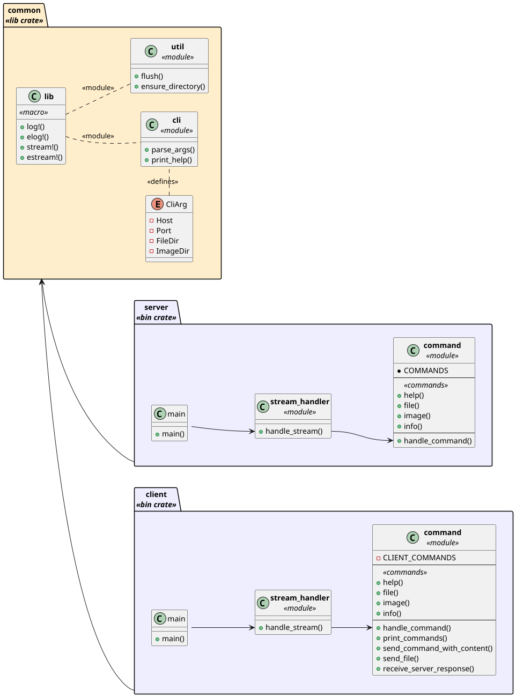
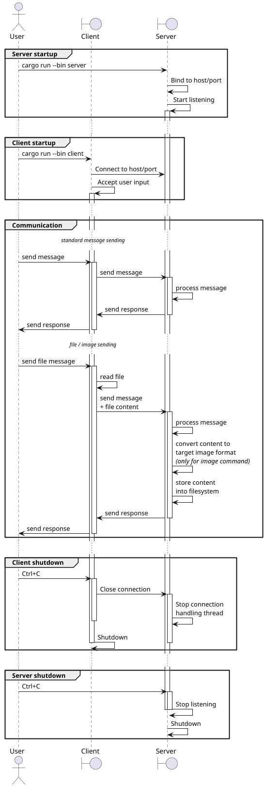

# Chatee - Rust(ical) homework 16

This project implements a client-server chat application written in Rust as a homework for the Rust course.

**Table of contents**

- [Overview](#overview)
- [Project structure](#project-structure)
- [Building the project](#building-the-project)
- [Running the server](#running-the-server)
- [Running the client](#running-the-client)
- [Runtime parameters](#runtime-parameters)
- [Solution internals](#solution-internals)
    - [Communication details](#communication-details)
    - [Server operation overview](#server-operation-overview)
    - [Client operation overview](#client-operation-overview)
    - [Full communication sequence](#full-communication-sequence)
- [Supplementary information](#supplementary-information)
    - [Solution diagrams](#solution-diagrams)

## Overview

The functionality of the application is simple: the server listens for incoming messages from clients and prints them.
If the message starts with `.{command}`, the server performs the command and sends the result back to the client.

The following commands are supported:

| Command   | Arguments   | Description                                                               |
|-----------|-------------|---------------------------------------------------------------------------|
| `.file`   | `file_name` | sends a file to the server (stored in the `files/` directory)             |
| `.image`  | `file_name` | sends an image to the server (stored in the `images/` directory as `png`) |
| `.info`   | `info text` | sends an info-labeled text to the server (just logged for now)            |
| `.help`   |             | sends help message with all possible commands back to the client          |
| `any_msg` |             | message (logged on the server side)                                       |

## Project structure

The project consists of three crates: a `server` and a `client` binary crates, with a shared `common` library crate
containing utilities used by both.

The project uses top-level workspace definition in the `Cargo.toml` file to manage the crates, the centralized handling
is hence possible (see below chapters).

The overall dependency graph is visible on the diagram below:



## Building the project

To build the project and all its crates, run the following command:

```shell
cargo build
```

... or in release mode:

```shell
cargo build --release
```

Alternatively, you can build a specific crate by going into its directory and running the same command:

```shell
cd server
cargo build
```

## Running the server

To run the server, execute the following command:

```shell
cargo run --bin server
```

In case you want to run the server in release mode, use the following command:

```shell
cargo run --bin server --release
```

To run the binaries directly, you can also use the following command:

```shell
./target/debug/server
```

... or in release mode:

```shell
./target/release/server
```

## Running the client

To run the client, execute the following command:

```shell
cargo run --bin client
```

In case you want to run the client in release mode, use the following command:

```shell
cargo run --bin client --release
```

To run the binaries directly, you can also use the following command:

```shell
./target/debug/client
```

... or in release mode:

```shell
./target/release/client
```

## Runtime parameters

Both the server and the client accept runtime parameters. To see the list of available parameters, run the respective
binary using the following command:

```shell
cargo run --bin server -- --help
cargo run --bin client -- --help
```

The currently available parameters are:

- `--host` - the host to connect to (for the client) or to listen on (for the server)
- `--port` - the port to connect to (for the client) or to listen on (for the server)

## Solution internals

### Communication details

The server and the client communicate using a custom TCP protocol to exchange messages. The server listens on the specified host and port,
accepts incoming connections, and processes the messages sent by the clients. The messages are serialized and deserialized
using the `serde` library, which allows for easy conversion between Rust data structures and JSON.

### Server operation overview

The server spawns new threads to handle incoming connections concurrently. Each connection is handled in a separate
thread, and the server can handle multiple connections at the same time. Single client is handled by a single thread,
which processes the incoming messages and performs the specified commands (e.g., saving files, images, logging
messages). The server sends the responses back to the client, which displays them to the user.

### Client operation overview

The client connects to the server using the specified host and port, sends messages to the server, and receives the
responses. The client can send messages of different types (text, file, image) and receive responses from the server.

### Full communication sequence

The below sequence diagram describes the full communication between the client and the server:



## Supplementary information

### Solution diagrams

The diagrams used in this documentation are created using the PlantUML tool. The source files for the diagrams
can be found in the [docs/diagram](docs/diagram) directory. To generate the diagrams, you can use the PlantUML tool
directly, any of the online tools available or, for the best results, the plugin for realtime PlantUML regeneration
as you type for your favorite IDE.
